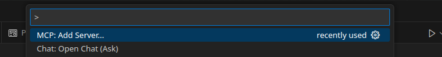
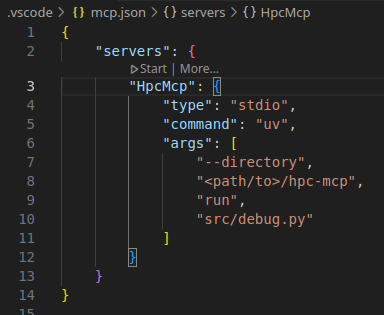

# hpc-mcp :zap::computer:

This project provides MCP tools for HPC. These are designed to integrate with LLMs. My initial plan
is to integrate with LLMs called from IDEs such as [cursor](https://cursor.com/) and
[vscode](https://code.visualstudio.com/).

## Quick Start Guide :rocket:

This project uses [uv](https://github.com/astral-sh/uv) for dependency management and installation.
If you don't have uv installed, follow [installation
instructions](https://docs.astral.sh/uv/getting-started/installation/) on their website.

Once we have `uv` installed we can install the dependencies and run the tests with the following
command:

```bash
uv run --dev pytest
```

### Adding the MCP Server
#### Cursor

1. Open Cursor and go to settings.
2. Click `Tools & Integrations`
3. Click `Add Custom MCP`

> [!NOTE]
> This will open your system-wide MCP settings (`$HOME/.cursor/mcp.json`). If you prefer to set this
> on a project-by-project basis, then you can create a local configuration using
> `<path/to/project/root>/.cursor/mcp.json`.

4. Add the following configuration:

```json
{
  "mcpServers": {
    "hpc-mcp": {
      "command": "uv",
      "args": [
                "--directory",
                "<path/to>/hpc-mcp",
                "run",
                "src/debug.py"
            ]
    }
  }
}
```

#### VSCode

1. Open command palette (<kbd>Ctrl</kbd>+<kbd>Shift</kbd>+<kbd>p</kbd>) and select `MCP: Add Server...`



2. Choose the option `command (stdio)` since the server will be run locally
3. Type the command to run the MCP server:
```bash
uv --directory <path/to>/hpc-mcp run src/debug.py
```
4. Select reasonable name for the server e.g. "HpcMcp" (camel case is a convention)
5. Select whether to add the server locally or globally.
6. You can tune the settings by opening `setting.json` (global settings) or `.vscode/setting.json` (workspace settings)




### Test the MCP Server

Test the mcp using our simple example
    - open terminal
    - `cd example/simple`
    - build the example using `make`
    - this should generate `segfault.exe`
    - then type the following prompt into your IDE LLM agent
```
"debug a crash in the program examples/simple/segfault.exe"
```
    - this should ask your permission to run `debug_crash` mcp tool
    - accept and you should get a response like the following


## Core Dependencies

- `python`
- `uv`
- `fastmcp`
